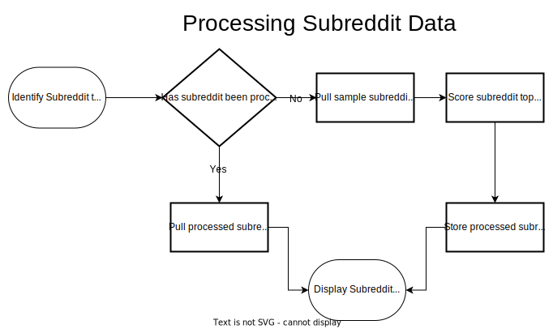

# HackMT 2023 Data Science Club

## Getting Started

### GitHub

Create a GitHub Account if you do not already have one and install [GitHub Desktop Client](https://docs.github.com/en/desktop/installing-and-configuring-github-desktop/installing-and-authenticating-to-github-desktop/installing-github-desktop). This will provide a simple way of getting files from and pushing files to GitHub.

Please message Alex Antonison on Discord or e-mail Alex Antonison (Alex.Antonison@mtsu.edu) with your GitHub Username to be given permission to work with the project.

### Python Environment

Set up environment using python 3.10

Install Python packages in [anaconda-environment.txt](./anaconda-environment.txt)

Set up a `.env` file from the [.env_template](./.env_template). The `.env` file contains sensitive information and should not be uploaded to GitHub. It is in the [.gitignore](./.gitignore) file which will prevent it from being committed to source control via a Git Commit.

### Working with API

#### API Setup

**Check out [setup-api.md](./setup-api.md) for getting setup with the API**

#### API Notes

Go to the Reddit API docs for getting started with the API [https://praw.readthedocs.io/en/stable/getting_started/quick_start.html](https://praw.readthedocs.io/en/stable/getting_started/quick_start.html))

For redirect api, use `http://localhost:8080` (sourced from [https://praw.readthedocs.io/en/latest/getting_started/authentication.html](https://praw.readthedocs.io/en/latest/getting_started/authentication.html))

Good resource for getting started [https://praw.readthedocs.io/en/stable/getting_started/quick_start.html](https://praw.readthedocs.io/en/stable/getting_started/quick_start.html).

### Architecture

