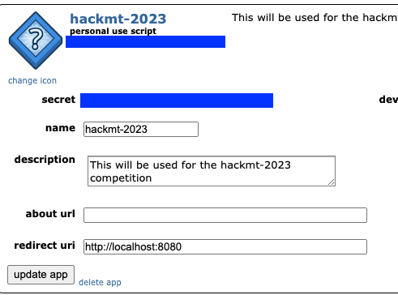

# Setup API Tutorial

1. Create a Reddit Account if you do not already have one.
2. Create an App
   1. Go to [https://old.reddit.com/prefs/apps/](https://old.reddit.com/prefs/apps/)
   2. Scroll down and select `create app`
      1. `Name:` HackMT-2023
      2. Select Script
      3. Description: Blank
      4. about url: Blank
      5. `redirect uri:` `http://localhost:8080`
   3. Once created, take note of the hashed key under the app name and the secret (blue boxes)
      1. 
   4. Make a copy of the [.env_template](.env_template) and name it `.env`
      1. reddit_client_secret
         1. Is the `secret` from the app
      2. reddit_client_id
         1. Is the id under the app name
      3. reddit_user_agent
         1. This is an id for tracking the requests
         2. "{operating system}:com.example.myredditapp:v1.2.3 (by u/{username})"
            1. An example "macos:com.example.myredditapp:v1.2.3 (by u/tehzeno)"